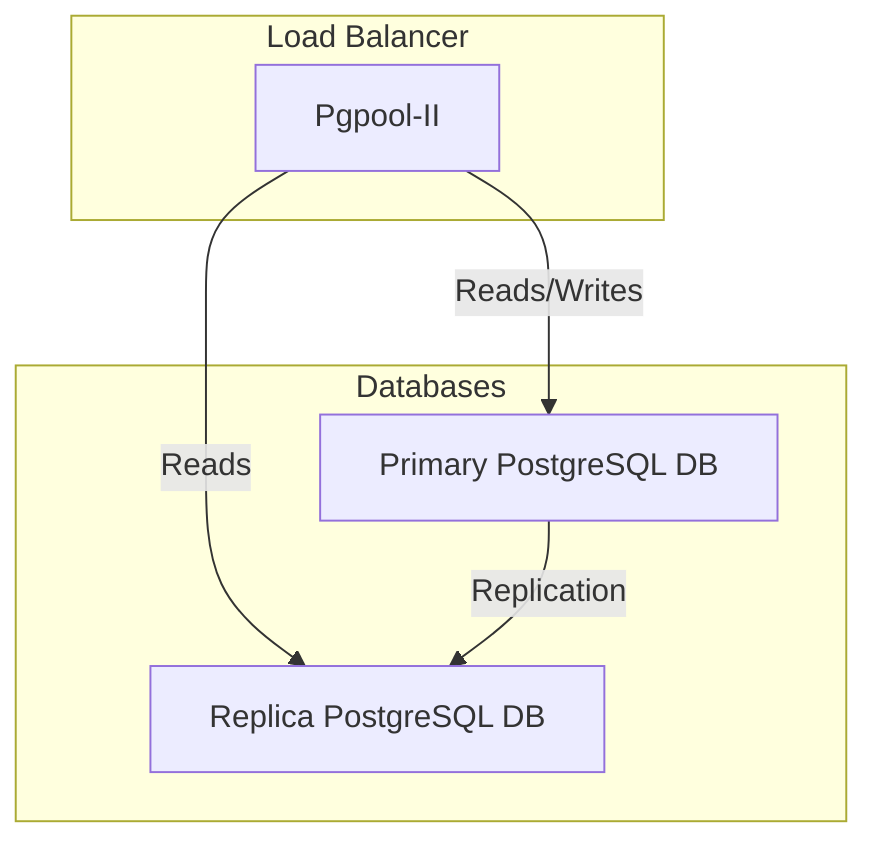

# Setup Ansible ARA cluster with Docker-compose

## 1. Introduction

[ARA Records Ansible](https://ara.readthedocs.io/) is an open-source tool that provides reporting and analytics for Ansible playbooks. Running ARA in a cluster with Docker Compose simplifies deployment and scaling.

## 2. Prerequisites

Before setting up ARA, ensure you have the following installed:

- Docker (>= 20.x)
- Docker Compose (>= v2.x)
- Git (optional, for cloning repositories)
- apache2-utils

## 3. Getting started



For example, we have two hosts with hostname and corresponding ip address:

| Hostname | IP              |
| -------- | --------------- |
| pg-0     | 192.168.122.141 |
| pg-1     | 192.168.122.42  |
| # vip ip | 192.168.122.142 |

Add entries to `/etc/hosts/`:

```shell
192.168.122.141 pg-0
192.168.122.42 pg-1
```

1. First, clone this repository on both hosts:

```shell
git clone https://github.com/ntk148v/ansible-ara-cluster /opt/ansible-ara-cluster
cd /opt/ansible-ara-cluster
```

2. Create a .htpasswd file with an encrypted username/password

```shell
htpasswd -c -m ./nginx/htpasswd admin
# Enter your desired password
```

3. Create your own `.env` and edit it, checkout [bitnami docs](./https://github.com/bitnami/containers/blob/main/bitnami/pgpool/README.md#configuration).

```shell
cp .env.example .env
```

4. Setup your keepalived to manage your VIP (192.168.122.142).
5. Start all services on both hosts.

```shell
docker compose up -d

docker compose ps
NAME         IMAGE                           COMMAND                  SERVICE      CREATED          STATUS                    PORTS
ara          recordsansible/ara-api:latest   "bash -c '/usr/local…"   ara          19 minutes ago   Up 19 minutes             8000/tcp
nginx        nginx:latest                    "/docker-entrypoint.…"   nginx        19 minutes ago   Up 19 minutes             80/tcp, 0.0.0.0:8000->8000/tcp, :::8000->8000/tcp
pgpool       docker.io/bitnami/pgpool:4      "/opt/bitnami/script…"   pgpool       19 minutes ago   Up 19 minutes (healthy)   0.0.0.0:5432->5432/tcp, :::5432->5432/tcp
postgresql   bitnami/postgresql-repmgr:17    "/opt/bitnami/script…"   postgresql   19 minutes ago   Up 19 minutes             0.0.0.0:5433->5432/tcp, :::5433->5432/tcp

# Check your pool nodes
docker exec -it pgpool bash
PGPASSWORD=$PGPOOL_POSTGRES_PASSWORD psql -U $PGPOOL_POSTGRES_USERNAME -h localhost
postgres=# show pool_nodes;
 node_id | hostname | port | status | pg_status | lb_weight |  role   | pg_role | select_cnt | load_balance_node | replication_delay | replication_state | replication_sync_state | last_status_change
---------+----------+------+--------+-----------+-----------+---------+---------+------------+-------------------+-------------------+-------------------+------------------------+---------------------
 0       | pg-0     | 5433 | up     | up        | 0.500000  | primary | primary | 0          | true              | 0                 |                   |                        | 2025-02-12 07:27:39
 1       | pg-1     | 5433 | up     | up        | 0.500000  | standby | standby | 0          | false             | 0                 |                   |                        | 2025-02-12 07:27:39
```

6. Verify ARA API. Open <http://VIP:8000> (in this example, it is 192.168.122.142) to access the WebUI. Enter your password you've set before.
